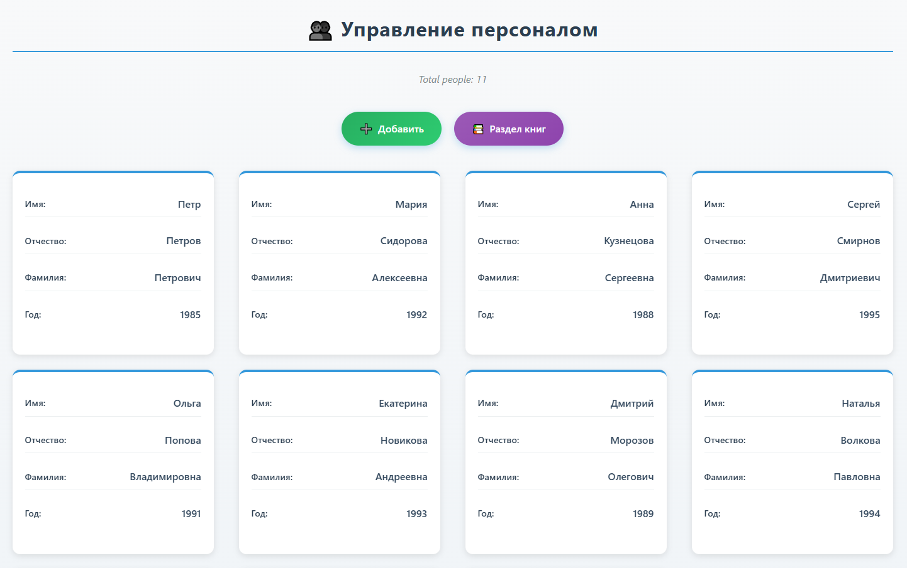
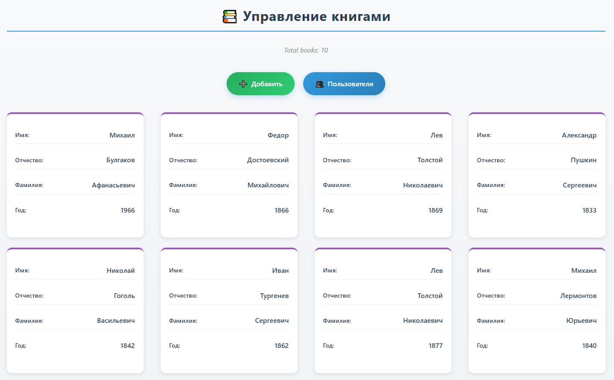
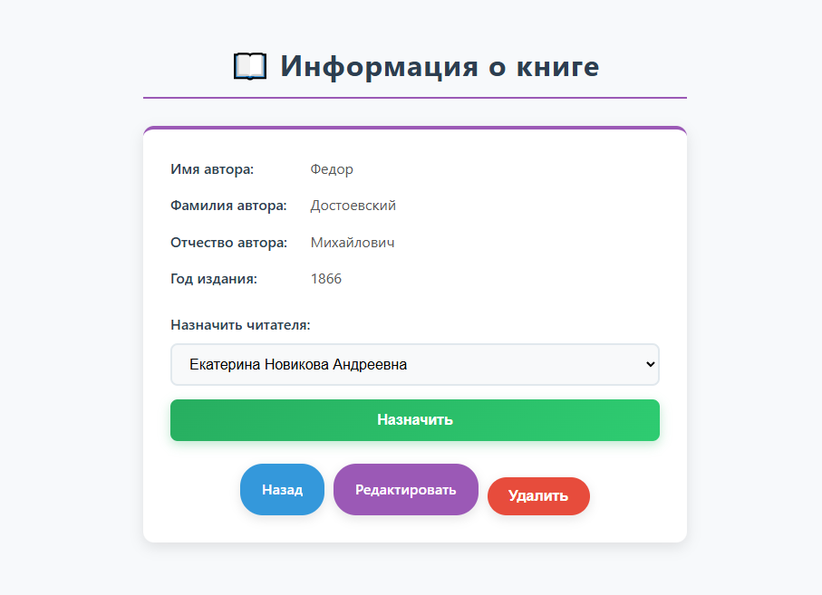
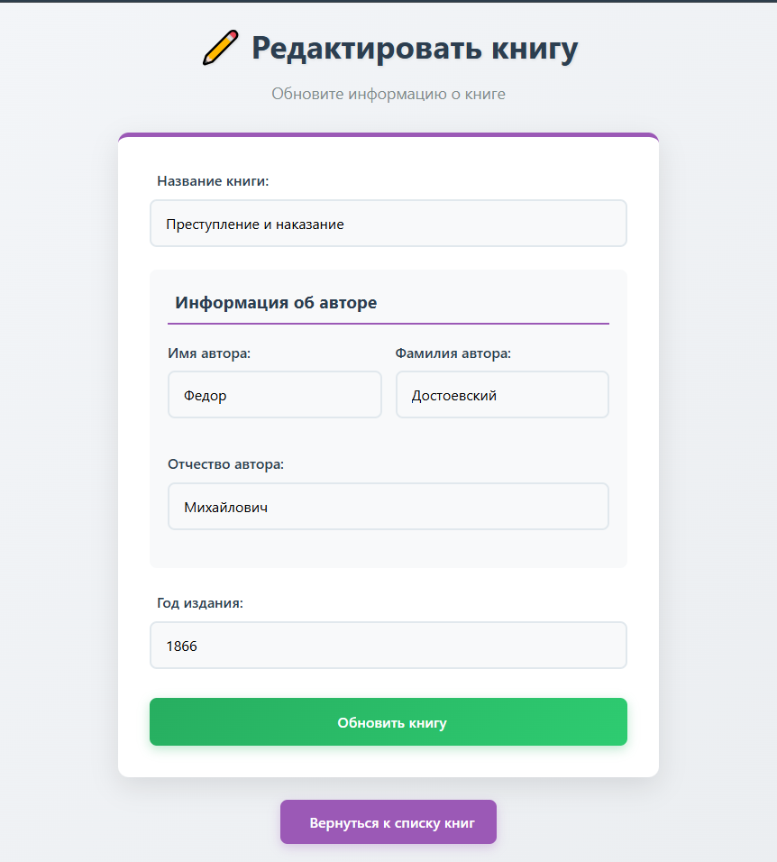

# Электронная библиотека

Возможности
1. Добавление, изменение и удаление человека.
2. Добавление, изменение и удаление книги.
3. Страница со списком всех людей.
4. Страница со списком всех книг.
5. Страница человека с его полями и списком взятых книг.
6. Страница книги с её полями и информацией о человеке, который взял книгу.

Структура базы данных (пример для PostgreSQL)

```sql
CREATE TABLE people (
  id SERIAL PRIMARY KEY,
  first_name VARCHAR(50) NOT NULL,
  last_name VARCHAR(50) NOT NULL,
  sur_name VARCHAR(50) NOT NULL,
  year INTEGER NOT NULL
);

CREATE TABLE books (
  id SERIAL PRIMARY KEY,
  title VARCHAR(100) NOT NULL,
  first_name_author VARCHAR(50) NOT NULL,
  last_name_author VARCHAR(50) NOT NULL,
  sur_name_author VARCHAR(50) NOT NULL,
  year INTEGER NOT NULL,
  id_person INTEGER,
  FOREIGN KEY (id_person) REFERENCES people (id)
);
```

Пример вставки данных (несколько записей)

```sql
INSERT INTO people (first_name, last_name, sur_name, year)
VALUES ('Иван', 'Иванов', 'Иванович', 1990),
       ('Петр', 'Петров', 'Петрович', 1985);

INSERT INTO books (title, first_name_author, last_name_author, sur_name_author, year, id_person)
VALUES ('Мастер и Маргарита', 'Михаил', 'Булгаков', 'Афанасьевич', 1966, 1),
       ('Преступление и наказание', 'Федор', 'Достоевский', 'Михайлович', 1866, NULL);
```

Запуск приложения
- Убедиться, что PostgreSQL запущен и доступна БД.
- Настроить `application2.properties`
- Собрать и запустить:
    - mvn clean package
    - mvn spring-boot:run
- Приложение доступно по умолчанию на `http://localhost:8080`.

Страницы
- `/people` — список людей.
- `/people/new` — форма добавления человека.
- `/people/{id}` — профиль человека с его книгами.
- `/people/{id}/edit` — редактирование человека.
- `/books` — список книг.
- `/books/new` — форма добавления книги.
- `/books/{id}` — страница книги с информацией о взявшем.
- `/books/{id}/edit` — редактирование книги.

Файлы со скриншотами



